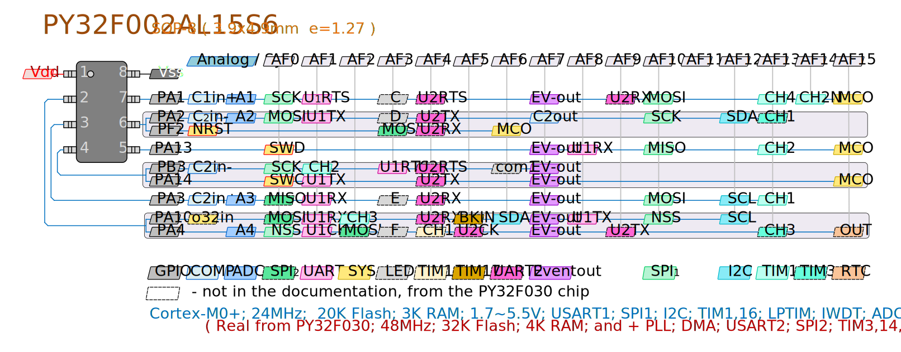
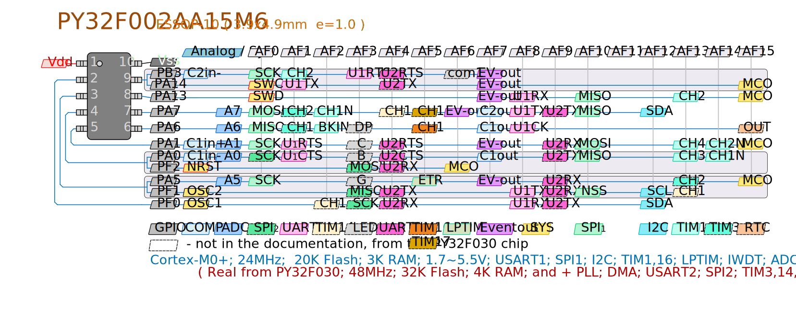
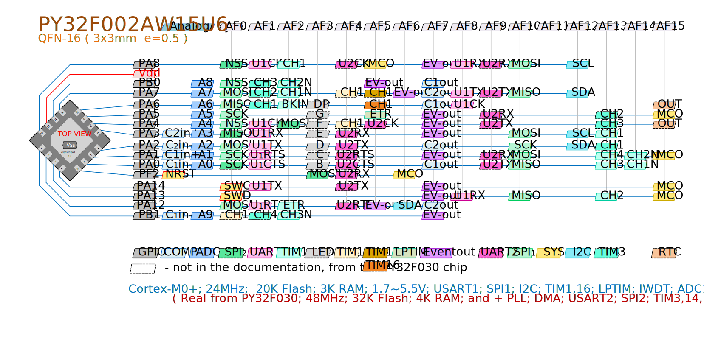
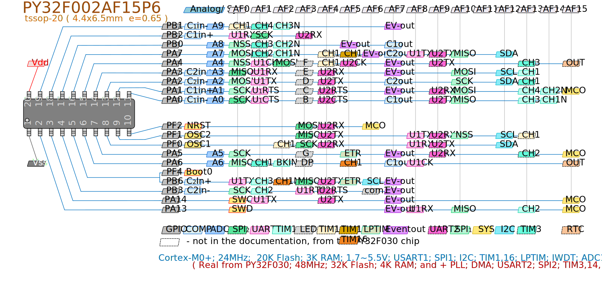
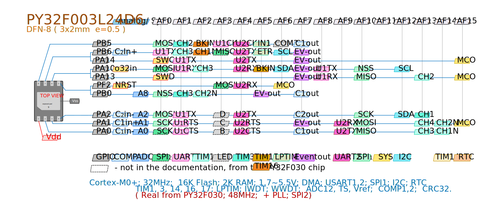
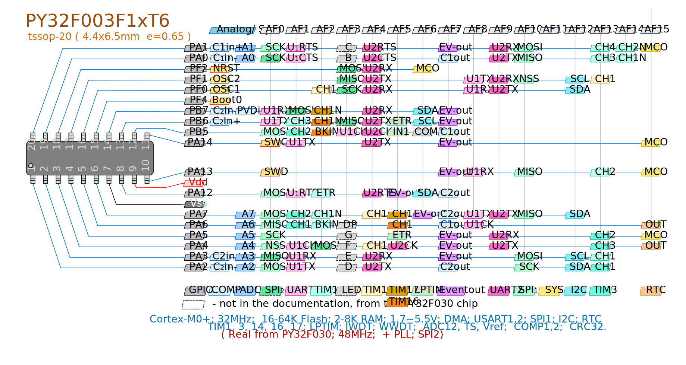
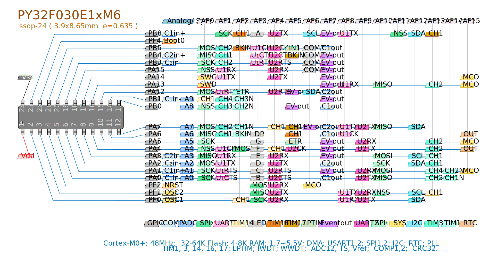
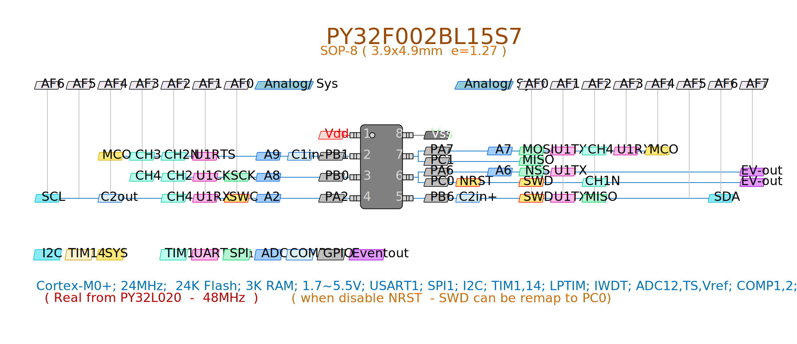
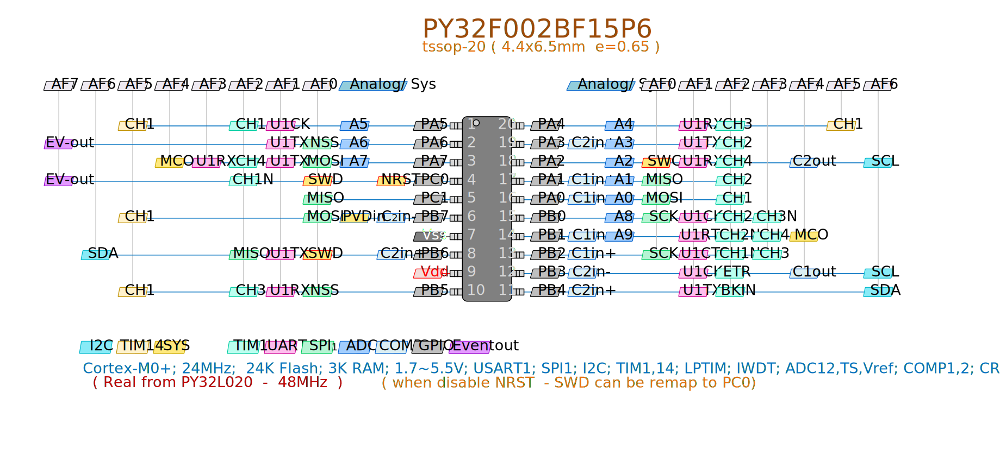
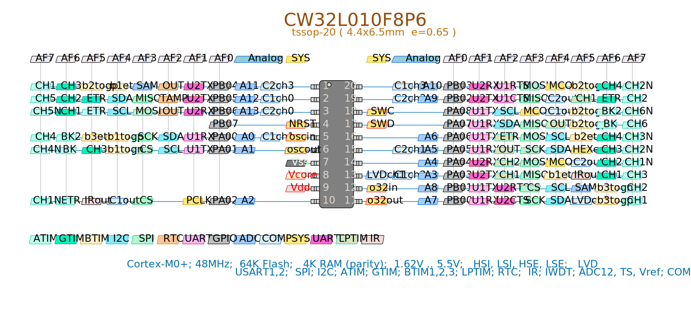

$\Large\textbf{\color{orange}Quick Reference}$

### -- PY32F002A --

Выведены все возможные комбинации альтернативных функций 
Даже выводы неполных по функциональности модулей

### -- PY32F003 --

### -- PY32F030 --

### -- PY32F002B --

### -- CW32L010 --

